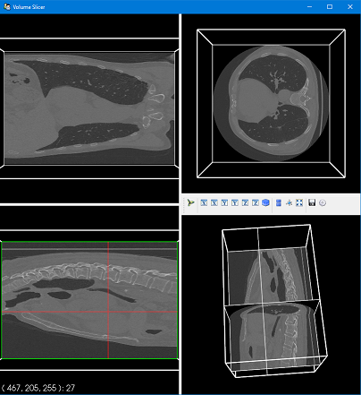

DICOM Slicer Viewer
===================

This code visualizes the axial, sagittal and coronal planes using [Mayavi](https://docs.enthought.com/mayavi/mayavi/) of DICOM data. The code used the [Volume slicer example](https://docs.enthought.com/mayavi/mayavi/auto/example_volume_slicer.html#example-volume-slicer) as part of the documentation of Mayavi.  Basically, the volume is read from a DICOMDIR file.
It is necessary the installation as 

`pip install mayavi`

and that's it.

At beginning of the script, there is a path in my local machine for the DICOMDIR (the `filepath` variable). This code considers only the 1st series & 1st study (just for testing purposes), the ideal is select the serie/study that you want.

> The colormap is not working properly

###### If you want to contribute to this project and make it better, your help is very welcome.